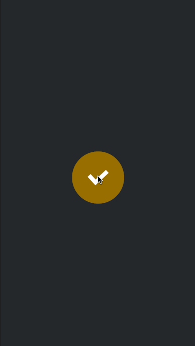

# Pulse Button Concept

Attempt at animating a button using two parts to the animation:
1) Spring animating the button on tap
2) A background layer animating outwards

GIF created with [LiceCap](http://www.cockos.com/licecap/).

Jan Senderek
